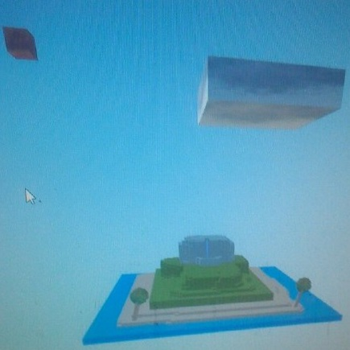
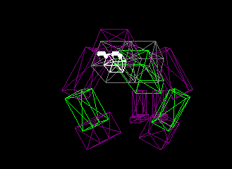
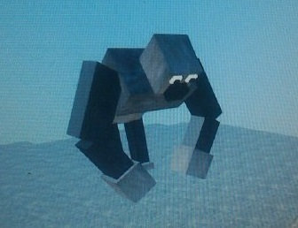
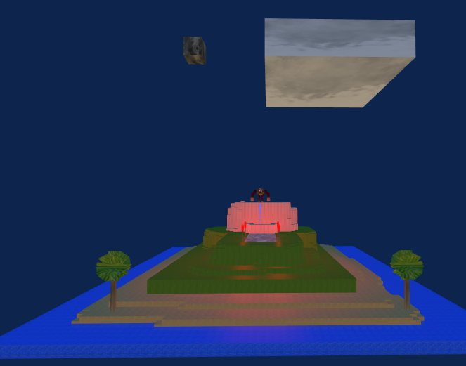

<meta charset="utf-8">

# AUTORI

Buonsanto Vito, Pepe Grazia.

------------------------------------------------------------------------------------------------------------------------------

# DESCRIZIONE

L'idea inziale è stata quella di creare una piccola scena interattiva con un oggetto animato che ripetesse l'azione in loop.
Non avendo familiarità con questo tipo di progetti e funzioni abbiamo cominciato a giocare e sperimentare i codici sorgente del 
professore e abbiamo provato gli esempi dei colleghi degli anni passati.
Una volta capito come funzionasse abbiamo pensato a cosa voler realizzare nello specifico. Abbiamo pensato di ricreare una piccola scena del
film King kong. Quindi abbiamo realizzato una scena iniziale (l'isola) realizzata con l'heightmap partendo da un cubo. Si è poi realizzato
il nostro protagonista (gorilla) e successivamente lo si è animato. La scena è stata semplificata pensando di modificare l'immagine
heightmap giocando con le varie sfumature di bianco/nero per ottenere una parte più bassa che rappresenterà l'acqua, e via via si
è sfumato verso il bianco per ottenere la spiaggia, la foresta ed infine il promontorio.
Si sono aggiunti due alberi sulla spiaggia, una piccola cascata e si è posizionato il gorilla sulla parte più alta dell'isola.
Infine per creare una scena più suggestiva, siè aggiunto il verso del king kong ed in oltre
si pensato di ambientare la scena di notte, quindi un colore di background più scuro, la luna ed una bassa illuminazione.
 Si è poi sfruttata la proprietà delle Mesh MeshPhongMaterial andando ad applicare sugli oggetti torcia dei punti luce
rossi così da illuminare la zona col gorilla cercando di ricreare l'effetto "notte".

Il progetto fa uso di varie librerie di Three.js  contenute in lib, le textures:
il gorilla, luna, nuvola, legno (albero/torcia),palma, sabbia, prato, roccia,acqua contenute nella cartella textures;
un file index.html contenente tutto il codice,una cartella sound con il verso del king-kong ed una cartella images con alcuni esempi.

----------------------------------------------------------------------------------------------------------------------------

# PROCESSO

La scena è composta da un terreno ottenuto da una heightmap modificata, a cui vengono applicate delle textures.
Al terreno sono stati aggiunti vari modelli: il gorilla, due alberi,luna,nuvola,cascata, 4 torce.
Il gorilla ha diverse animazioni riprodotte in loop: 
1) Posizone di partenza ( su 4 zampe) si alza su due zampe e alza le braccia.
2) Batte i pugni sul petto andando ad alternare il movimento delle due braccia (-parte il suono/verso del king kong)
3) Dopo un tempo X l'animazione delle braccia si blocca e riporta le braccia dritte e le abbassa ( -stop suono)
4) Si rimette su 4 zampe
5) Dopo un tempo Y l'animazione riparte e va in loop

La prima fase è stata quella di creare la scena iniziale partendo da un cubo e utilizzre le funzioni di heightmap e creazione del terreno
per costruire la nostra scena (isola) 

In un secondo progetto, si è sviluppato il modello del gorilla, costruti con una serie di cubi per ottenere: busto, pettorali, gambe, piedi, avanbracci,
braccia, pugni, testa, muso, occhi e pupille.

Si sono poi uniti opportunamente gli oggetti in una relazione a cascata così da poter poi realizzare l'animazione in modo tale che il gorilla si muovesse
in modo uniforme ed infine lo si è aggiunto alla scena

 

Infine siamo andati ad aggiungere le torce alla scena e i vari punti luce per ottenere l'effetto "notte".
Si è aggiunto il suono all'animazione.
Il risultato finale:

--------------------------------------------------------------------------------------------------------------------------------
 

# NOTE

Il file è stato testato con google-chrome.

<!-- Markdeep: -->

 